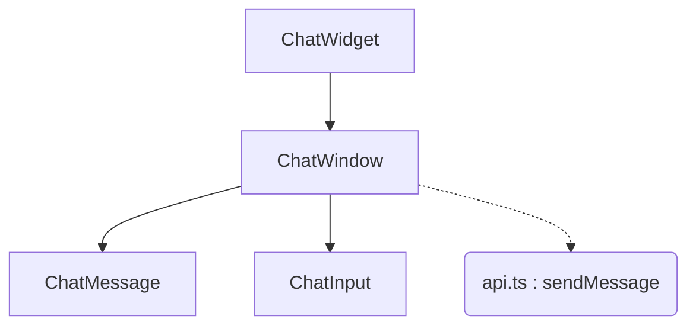

# Plan: 007 - Frontend Widget

## Component Architecture

## Styling Strategy
O Tailwind CSS do projeto Next.js em `frontend-widget` será utilizado com a diretiva `prefix: 'tw-chat-'` no `tailwind.config.ts`. Isso assegura isolamento de dentro para fora (o widget não quebra o site host).

Para a integração visual, adotaremos a técnica de "Herança por Variáveis CSS":
1. **Configuração do Tailwind**: Cores da interface serão mapeadas para CSS Custom Properties (ex: `var(--chat-primary-color, #2563eb)`).
2. **Distribuição via Script**: O build final será configurado para gerar um único script (ex: `embed.js`). Este script injetará a aplicação diretamente no DOM do host, viabilizando a herança da tipografia natural do site sem a interferência de `iframes`.

## State Management
- `messages` e `sessionId` residirão em `ChatWindow` para evitar passagem de dados complexa.
- `isLoading` irá desabilitar o form interno de `ChatInput`.

## Communication Protocol
Requisições HTTP para `/api/v1/chat/message` utilizarão o token JWT. Headers CORS da Spec 004 garantirão acesso web via `localhost` inicialmente.
